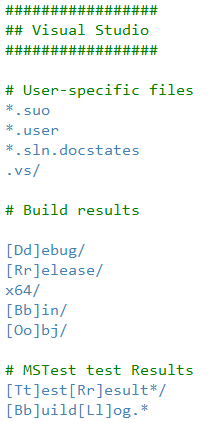
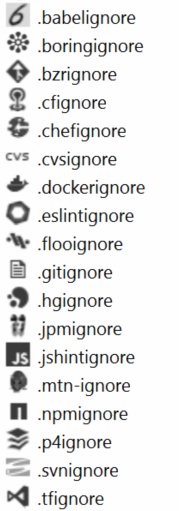

# .ignore

Download this extension from the [VS Gallery](https://visualstudiogallery.msdn.microsoft.com/d0eba56d-603b-45ab-a680-edfda585f7f3)
or get the [CI build](http://vsixgallery.com/extension/7ac24965-ea21-4108-9cac-6e46394aaaef/).

---------------------------------------

This extension supports *.gitignore (Git), .tfignore (Team Foundation),
.hgignore (Mercurial), .npmignore (npm), .dockerignore (Docker),
.chefignore (Chef), .cvsignore (CVS), .bzrignore (Bazaar),
.jshintignore (JSHint), .eslintignore (ESLint), .cfignore (Cloud Foundry)*

See the [changelog](CHANGELOG.md) for changes and roadmap.

## Features

- Syntax highlighting
- File icons in Solution Explorer
- Non-matching file paths are grayed out

### Syntax highlighing
Syntax highlighting for all any type of .ignore file.

### File icons
Correct file icons will be shown for all the .ignore files.

### Non-matches
If a file path doesn't point to a file or foldre, then it
is being grayed out.

## Contribute
Check out the [contribution guidelines](CONTRIBUTING.md)
if you want to contribute to this project.

For cloning and building this project yourself, make sure
to install the
[Extensibility Tools 2015](https://visualstudiogallery.msdn.microsoft.com/ab39a092-1343-46e2-b0f1-6a3f91155aa6)
extension for Visual Studio which enables some features
used by this project.

## License
[Apache 2.0](LICENSE)